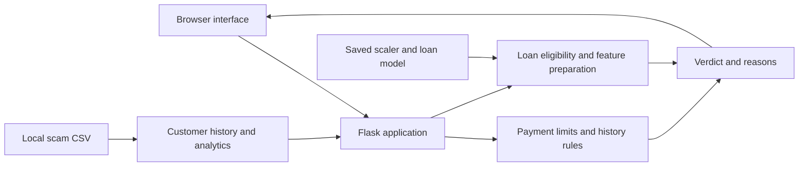

# FinRisk AI

### Financial fraud screening and loan risk analysis in one dashboard

FinRisk AI brings customer transaction history, fraud screening, and loan default
prediction into a single Flask application. It combines a browser-based review
workflow with machine-learning experiments, giving users a way to explore risk
signals and understand the reasons behind an assessment.

**Built with:** Python · Flask · scikit-learn · pandas · NumPy · Chart.js

[Problem](#the-problem) · [Features](#key-features) ·
[Model results](#model-performance) · [Setup](#setup-and-run) ·
[API](#routes-and-request-examples) · [Roadmap](#roadmap)

## The problem

Transaction records alone do not make it easy to identify customers with a
history of fraud, compare patterns across locations, or assess loan repayment
risk. Reviewing these details separately adds manual work and makes it harder
to connect an individual decision with its supporting evidence.

FinRisk AI addresses this workflow by bringing together:

- **Customer context:** historical transactions, flagged records, and fraud types
  alongside the payment being reviewed.
- **Consistent screening:** customer lookup and transaction-limit checks before
  producing a payment verdict.
- **Loan risk assessment:** a trained classifier that returns a default-risk
  estimate and an approval/rejection label.
- **Portfolio visibility:** charts and summaries of fraud in the loaded dataset.

The project demonstrates a local financial-risk review workflow. It does not
connect to a bank, process payments, or persist submitted transactions, and no
real-world reduction in fraud losses has been measured.

## Key features

| Feature | What users can do |
| --- | --- |
| Transaction scanner | Enter an amount, customer ID, and payment type; receive a history-based verdict and reasons |
| Customer lookup | Inspect prior transactions, card types, locations, and flagged activity |
| Loan assessment | Submit income, loan amount, and purpose to estimate default risk |
| Analytics dashboard | Explore fraud counts, common fraud types, and affected locations |
| Customer risk profiles | View fraud rate, review recommendations, and recent records in CSV order |
| Model development | Explore notebooks and train scam, fraud-type, loan, payment, and credit-card classifiers |

## How it works



### Payment screening

- **Payment screening:** requires a numeric customer ID present in the scam
  dataset. After checking the selected transaction limit, any prior fraudulent
  record produces `FRAUD` with a fixed score of `85` and confidence of `95`.
  Customers with no flagged history receive `SAFE`, score `12`, and confidence
  `93`. The fraud type comes from the first available historical type.
  This endpoint currently uses history rules, not model inference, even though
  some interface labels describe model-based scoring.

### Loan assessment and analytics

- **Loan assessment:** monthly income below INR 60,000 is rejected immediately.
  Otherwise, a saved scaler and Gradient Boosting classifier estimate default
  risk. Class `0` maps to `APPROVED`; class `1` maps to `REJECTED`.
  The displayed approval value is `100 - default risk`.
- **Dashboard:** summarizes all records loaded from the scam CSV, including
  fraud counts, fraud types, and locations. The browser refreshes every 30 seconds,
  but the CSV is loaded only at server startup; restart after changing it.
- **Customer profiles:** show historical fraud rates, recommendations, and up to
  20 records in CSV order. The scanner's customer lookup shows up to six records.

The payment limits below are hardcoded application rules, not a statement of
banking or regulatory limits. Amounts above the limit are blocked; equal amounts
are allowed. Unknown transaction type strings currently bypass this limit check.

| Transaction type | Maximum amount (INR) |
| --- | ---: |
| UPI | 100,000 |
| CARD | 500,000 |
| ATM | 20,000 |
| WIRE | 10,000,000 |
| ECOM | 500,000 |
| NEFT | 10,000,000 |

## Model performance

The following results are **recorded notebook evaluations**, taken from saved
outputs in this repository. They have not been rerun for this README and are not
live application metrics. Precision, recall, and F1 refer to the positive class:
fraud for the fraud datasets and default for the loan dataset.

| Experiment | Algorithm | Accuracy | Precision | Recall | F1 | ROC-AUC | Test records |
| --- | --- | ---: | ---: | ---: | ---: | ---: | ---: |
| Scam detection [1] | Random Forest | ~91% | 0.82 | 0.90 | 0.86 | 0.9702 | 1,446 |
| Loan default [2] | Gradient Boosting | ~93% | 0.97 | 0.72 | 0.83 | 0.9423 | 6,517 |
| Credit-card fraud [3] | Random Forest | 99.9561% | 0.97 | 0.77 | 0.86 | Not recorded | 56,962 |
| Online-payment fraud [3] | Random Forest | 99.9724% | 0.98 | 0.80 | 0.88 | Not recorded | 1,272,524 |

**Sources:** [1] [Scam fraud analysis](notebooks/scam_fraud_analysis.ipynb),
[2] [Loan risk analysis](notebooks/loan_risk_analysis.ipynb),
[3] [Credit-card and payment experiments](notebooks/data_analysis.ipynb).

The dedicated scam and loan notebooks report accuracy rounded to two decimal
places, so their percentages are approximate. All four experiments use an 80/20
train/test split with `random_state=42`; the dedicated scam and loan notebooks
also stratify by the target label.

### Interpreting the results

- **Recall matters for fraud:** the credit-card test set contains only 98 fraud
  cases out of 56,962 records. Its high overall accuracy accompanies 77% fraud
  recall, so accuracy alone does not describe detection quality.
- **Thresholds change the tradeoff:** the loan notebook also evaluates a `0.3`
  threshold. Default recall increases from `0.72` to `0.76`, while precision falls
  from `0.97` to `0.88` and accuracy falls to approximately `92%`.
- **Experiments differ from the deployed workflow:** notebook preprocessing,
  model settings, and splits differ from `src/train_*.py`. These results do not
  establish the performance of the currently saved artifacts or the payment
  endpoint, which uses history rules. Credit-card and payment classifiers are
  standalone experiments rather than models served by the web app.
- **Evaluation can be strengthened:** preprocessing currently happens partly
  before splitting, and scam training chooses its threshold on the test set.
  Training-only preprocessing and a separate validation set are future work.

The older general-analysis notebook also contains a 99.81% scam result, but that
experiment leaves encoded `fraud_type` information in the inputs. It is excluded
from the table because that label-derived feature can leak the target. The
dedicated scam notebook removes it. UI figures such as `98.6%` are hardcoded
display values and are not used as evaluation evidence here.

## Technology stack

| Layer | Tools |
| --- | --- |
| Web backend | Flask, Jinja templates, JSON endpoints |
| Interface | HTML, CSS, JavaScript, Chart.js |
| Data preparation | pandas, NumPy, categorical encoding, missing-value handling |
| Machine learning | scikit-learn Random Forest, Gradient Boosting, StandardScaler |
| Artifact storage | Local CSV files and joblib-serialized models |
| Exploration | Jupyter notebooks, Matplotlib, Seaborn |

## Project layout

```text
src/
  app.py                       Flask entry point and JSON endpoints
  train_scam_model.py           Random Forest scam classifier
  train_fraud_type_model.py     Random Forest fraud-type classifier
  train_loan_model.py           Gradient Boosting loan classifier and scaler
  train_payment_model.py        Optional online-payment classifier
  train_creditcard_model.py     Optional credit-card classifier
templates/                     Home, dashboard, and customer-profile pages
static/                        CSS and browser JavaScript
notebooks/                     Exploratory analysis notebooks
data/                          Local CSV datasets (ignored by Git)
models/                        Trained artifacts (ignored by Git)
requirements.txt/txt           Python dependency file
test_predictions.py            Standalone scam-model diagnostic script
```

Use the root `src`, `templates`, and `static` folders to run the app. Local
reports and duplicate project files under `docs/` are excluded from Git and are
not needed to run the application.

## Setup and run

Run these commands from the project root with Python 3 available. The existing
dependency list is unpinned; use compatible scikit-learn versions for training
and loading saved artifacts, or regenerate them in your environment.

### 1. Install dependencies

Windows PowerShell (no environment activation required):

```powershell
python -m venv .venv
.\.venv\Scripts\python.exe -m pip install -r requirements.txt/txt
```

On macOS/Linux, use `.venv/bin/python` instead of
`.\.venv\Scripts\python.exe` in these commands.

`requirements.txt` is currently a **directory** containing a file named `txt`.
Use the full path above, rather than `pip install -r requirements.txt`.

### 2. Supply local datasets

Create `data/` if needed and supply the following CSV files. Datasets and trained
models are intentionally excluded from Git, so a fresh checkout needs local
copies. There is no automatic dataset downloader.

| Dataset | Used for |
| --- | --- |
| `data/Indian_Online_Scam_Dataset.csv` | Required at runtime; scam and fraud-type training |
| `data/loan_risk_dataset.csv` | Required to train the loan model |
| `data/online_payment_dataset.csv` | Optional payment-model training |
| `data/creditcard.csv` | Optional credit-card-model training |

Expected CSV columns:

- **Scam:** `transaction_id`, `customer_id`, `merchant_id`, `amount`,
  `transaction_time`, `is_fraudulent`, `card_type`, `location`,
  `purchase_category`, `customer_age`, `fraud_type`.
- **Loan:** `person_age`, `person_income`, `person_home_ownership`,
  `person_emp_length`, `loan_intent`, `loan_grade`, `loan_amnt`, `loan_int_rate`,
  `loan_status`, `loan_percent_income`, `cb_person_default_on_file`,
  `cb_person_cred_hist_length`.
- **Online payment:** `step`, `type`, `amount`, `nameOrig`, `oldbalanceOrg`,
  `newbalanceOrig`, `nameDest`, `oldbalanceDest`, `newbalanceDest`, `isFraud`,
  `isFlaggedFraud`.
- **Credit card:** `Time`, `V1` through `V28`, `Amount`, `Class`.

Use numeric customer IDs and binary fraud/default labels (`0` or `1`). Training
needs enough labeled examples for a train/test split, including fraudulent
records with nonempty fraud types. The runtime CSV is not cleaned in the same way
as the training data; incomplete records can cause errors.

### 3. Train the required models

If compatible artifacts are already present in `models/`, skip this step.
Training writes or overwrites artifacts in that directory.

```powershell
.\.venv\Scripts\python.exe src/train_scam_model.py
.\.venv\Scripts\python.exe src/train_fraud_type_model.py
.\.venv\Scripts\python.exe src/train_loan_model.py
```

The app loads all eight files below at startup, including the scam and fraud-type
artifacts that the current payment endpoint does not use for inference:

```text
scam_model.pkl             scam_features.pkl
fraud_type_model.pkl       fraud_type_features.pkl       fraud_type_encoder.pkl
loan_risk_model.pkl        loan_features.pkl             loan_scaler.pkl
```

Scam training also creates `scam_threshold.pkl`; the web app does not load it.
Optional training scripts are `src/train_payment_model.py` and
`src/train_creditcard_model.py`. Their outputs are not used by the current app.
All training scripts use an 80/20 split with `random_state=42` and print evaluation
results to the terminal.

### 4. Start Flask

```powershell
.\.venv\Scripts\python.exe src/app.py
```

Open [the local app](http://127.0.0.1:5000). Dashboard and customer profiles are
available from its navigation. The app starts in Flask debug mode.
Fonts and dashboard charts use external Google Fonts and Chart.js CDN resources.

No environment variables or credentials are currently required, so an
`.env.example` is unnecessary. Request examples are included below.

## Routes and request examples

| Method | Route | Purpose |
| --- | --- | --- |
| GET | `/` | Transaction scanner and loan form |
| GET | `/dashboard` | Analytics page |
| GET | `/customer-profile` | Customer profile page |
| GET | `/get_customer/<customer_id>` | Customer summary and six historical records |
| POST | `/predict_payment` | History-based payment verdict |
| POST | `/predict_loan` | Loan assessment |
| GET | `/api/dashboard-data` | Dataset-wide analytics |
| GET | `/api/customer-profile/<customer_id>` | Detailed customer risk and history |

Send JSON with `Content-Type: application/json`. For payment screening, replace
the placeholder with a numeric ID from your local CSV:

```json
{
  "customer_id": "REPLACE_WITH_DATASET_CUSTOMER_ID",
  "amount": 15000,
  "tx_type": "UPI"
}
```

Loan request (`POST /predict_loan`):

```json
{
  "income": 75000,
  "loan_amount": 500000,
  "purpose": "PERSONAL"
}
```

Supported loan purposes are `HOME`, `EDUCATION`, `VEHICLE`, `MEDICAL`, `BUSINESS`,
and `PERSONAL`. Payment validation failures return `blocked: true`, usually with
HTTP 200; customer lookup failures return `found: false`. The detailed profile
API uses HTTP 400 for an invalid ID and 404 for an unknown customer.

## Diagnostics and limitations

```powershell
.\.venv\Scripts\python.exe test_predictions.py
```

This script prints diagnostics; it is not an automated assertion-based test
suite. `test_predictions.py` evaluates the scam model directly and therefore
does not test the history rules in `/predict_payment`.

The project is a local demonstration. Displayed accuracy figures and several
homepage metrics are hardcoded, and confidence values are fixed or heuristic.
They are not live evaluation results. Loan inputs use fixed defaults for age,
employment, home ownership, grade, and credit history. The UI treats income as
monthly, while the backend passes it directly to `person_income` and annualizes
it only for the loan-to-income ratio; verify dataset units before interpreting
results. Input validation is limited, and no authentication is implemented.

Notebook tooling is separate from the listed application dependencies.

## Roadmap

- [ ] Connect transaction screening to a validated inference pipeline and make
  the use of customer history explicit in the final decision.
- [ ] Fit preprocessing only on training data; use separate validation and test
  sets, customer/time-aware splits, and reproducible evaluation reports.
- [ ] Align loan income units and collect the applicant features currently filled
  with defaults.
- [ ] Add request validation, endpoint tests, authentication, and a production
  server configuration.
- [ ] Replace hardcoded dashboard performance figures with measured results.
- [ ] Persist reviewed transactions and refresh analytics from stored records.
- [ ] Pin dependency versions and standardize the requirements file layout.

## Repository contents

`.gitignore` excludes directories named `data/` and `models/` at any depth,
the root `docs/` folder, local helper scripts `check_dataset.py` and
`create_powerpoint.py`, serialized model files, virtual environments,
Python/notebook caches, local environment files, generated logs and root
diagnostic outputs, and editor/OS files. Source code, analysis notebooks, this
README, and sanitized `.env.example` files remain eligible for version control.

Ignoring or untracking a directory keeps local files intact. Removing `docs/`
from a later commit does not erase it from earlier Git history.
